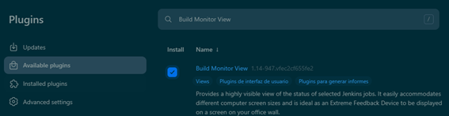
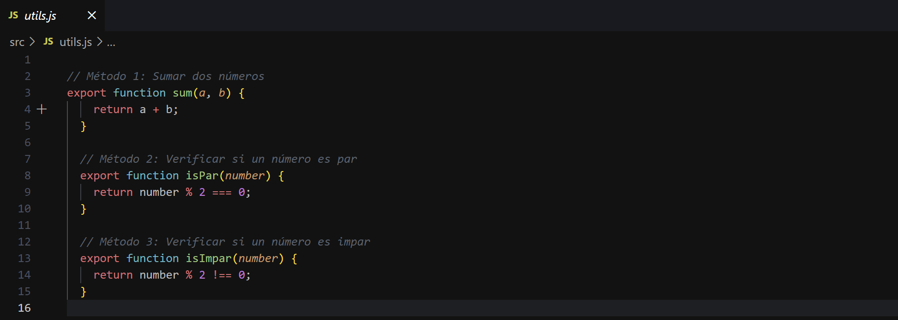
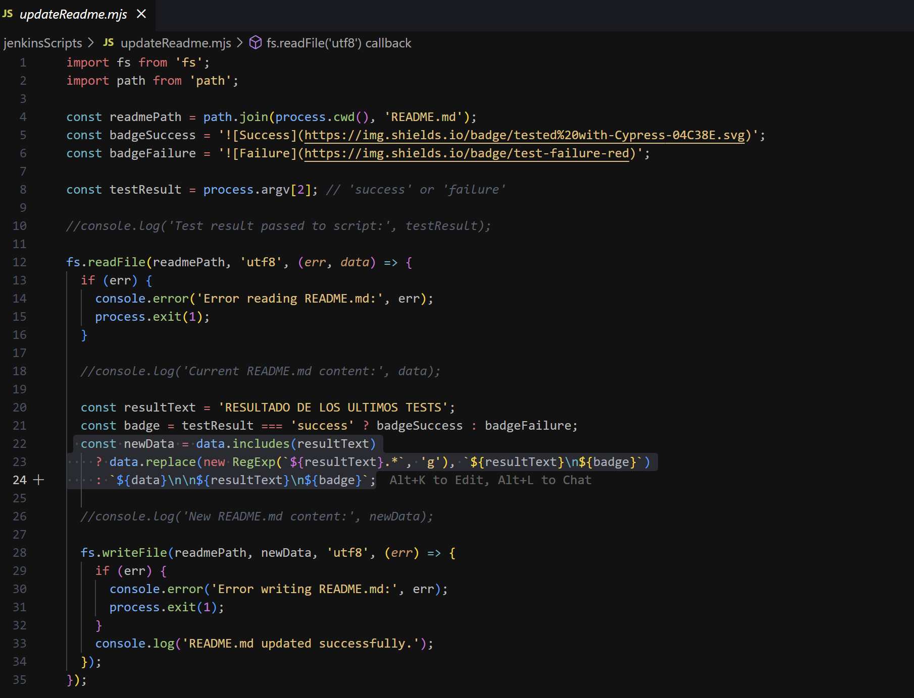
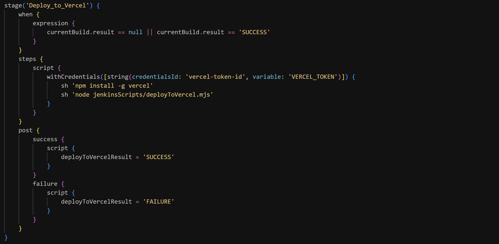
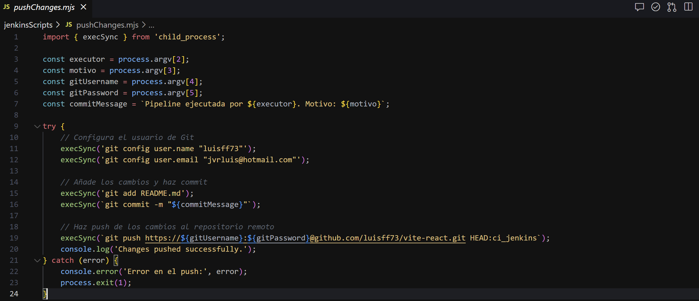

# Introducción
Este proyecto utiliza una pipeline declarativa de Jenkins para gestionar el flujo completo de desarrollo, pruebas y despliegue de una aplicación.  
Una pipeline es una secuencia de etapas que automatiza los pasos necesarios para construir, probar y desplegar el software.  
Este enfoque permite mantener un proceso repetible, eficiente y consistente.

### Conceptos Clave

En Jenkins, las pipelines definen las tareas de integración y despliegue continuo (CI/CD).  
Esta sintaxis organiza las etapas (stages) y los pasos (steps) necesarios para ejecutar las tareas.

### Stages y Steps:

Stages representan las etapas principales del proceso, como compilación, pruebas, construcción y despliegue.  
Estas etapas se dividen para estructurar el flujo de trabajo.  

Steps son las tareas específicas que se ejecutan en cada etapa, como comandos de shell, instalación de dependencias o ejecución de scripts.

Parámetros:
En este proyecto, se definen parámetros como Executor, Motivo y ChatID para capturar información dinámica proporcionada por el usuario al ejecutar la pipeline.  

### Post Actions:
Cada etapa puede incluir bloques post para realizar acciones específicas en función del resultado (éxito o fallo) de la etapa, como actualizar descripciones o enviar notificaciones.  

### Notificaciones:
En este pipeline, se utiliza la API de Telegram para enviar un resumen del estado de ejecución de la pipeline al usuario. Esto asegura una comunicación eficaz sobre el resultado.  

### Gestión de Credenciales:
Las credenciales sensibles, como tokens de acceso o contraseñas, se gestionan mediante el almacenamiento seguro de Jenkins.  
Estas se utilizan con los pasos withCredentials para proteger los datos sensibles durante la ejecución.  

### Automatización del Despliegue:

Vercel: Se utiliza como plataforma de despliegue para automatizar el lanzamiento de la aplicación.  
Esto asegura que los cambios aprobados lleguen rápidamente al entorno de producción.  

Integración Continua: Al utilizar herramientas como ESLint, Jest y Vite, el pipeline valida y construye el proyecto antes de desplegarlo.  
En caso de fallar alguno de los tests o comprobaciones el despliege no se realizaria.

Configuración del Pipeline
Para configurar y ejecutar esta pipeline en Jenkins, debemos seguir los pasos detallados a continuación:

### Preparar el Proyecto:

Nos aseguraremos de que el proyecto incluya un archivo Jenkinsfile en su raíz.
Definiremos los scripts auxiliares, como updateReadme.mjs, pushChanges.mjs, y deployToVercel.mjs, en la carpeta correspondiente (jenkinsScripts en este caso).  

# Configuracion de Jenkins:

Instalaremos Jenkins y nos asegúraremos de que los siguientes complementos/plugins estén instalados:  
NodeJS para ejecutar comandos relacionados con Node.js.  
Git para clonar y gestionar el repositorio.  
Pipeline para habilitar la ejecución de pipelines declarativas.  

### Configuracion de las Credenciales:

Crearemos credenciales en Jenkins para manejar los siguientes datos:
Acceso al repositorio de GitHub (usernamePassword).
Token de despliegue para Vercel (string).
Token de la API de Telegram (string).

### Crear un Proyecto en Jenkins:

Configuraremos un nuevo proyecto basado en un repositorio de Git que contenga el Jenkinsfile.
Para ello debemos marcar la opción para "Pipeline Script from SCM" y seleccionar el repositorio y rama deseados.

### Ejecutar la Pipeline:

Proporcionaremos los parámetros requeridos, como Executor, Motivo, y ChatID.
Podemos observar el progreso en la consola de Jenkins mientras las etapas se ejecutan:
Linter: Valida el código con ESLint.
Test: Ejecuta los tests con Jest.
Build: Construye el proyecto usando Vite.
Update_Readme: Actualiza el archivo README.md con el estado del pipeline.
Deploy_to_Vercel: Despliega la aplicación en Vercel.
Notificación: Envía el resultado de las etapas a través de Telegram.

### Notificaciones:

Finalmente enviaremos un mensaje a través de Telegram que resumira el estado final de cada etapa al final de la ejecución.  

# Documentación y explicación del proyecto.  

Para este proyecto utilizaremos un proyecto base en React / Vite que posteriormente desplegaremos en Vercel.

Una vez en local e iniciado el repositorio, crearemos una rama ci_jenkins para trabajar en este proyecto.  

  

  
  
  
  
  
  
  
  
  
  
  
  
  
  

RESULTADO DE LOS ULTIMOS TESTS

